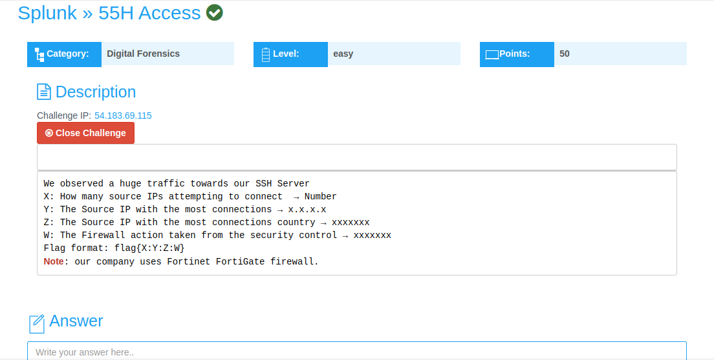
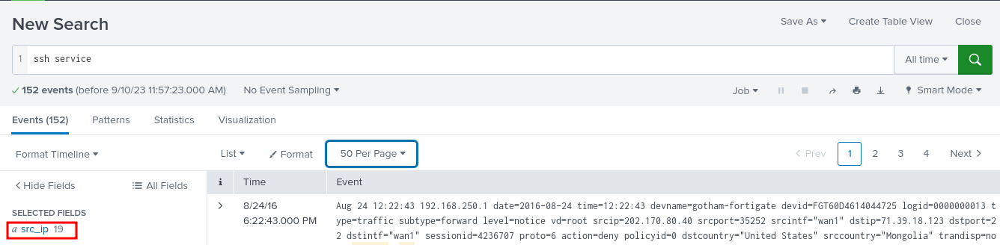
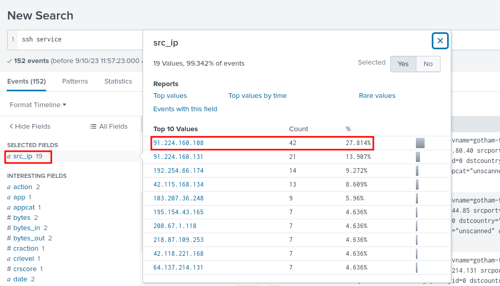
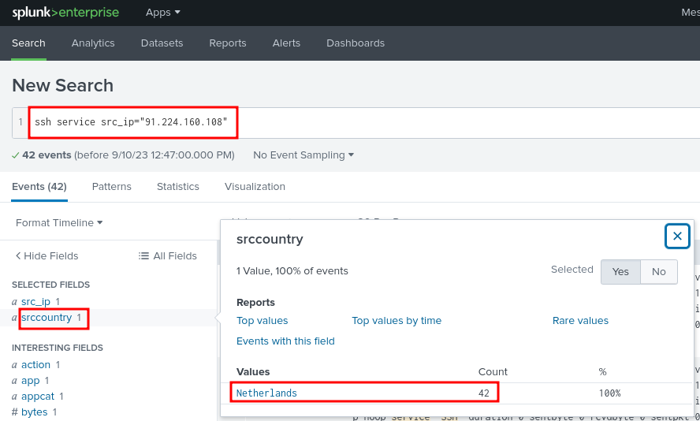
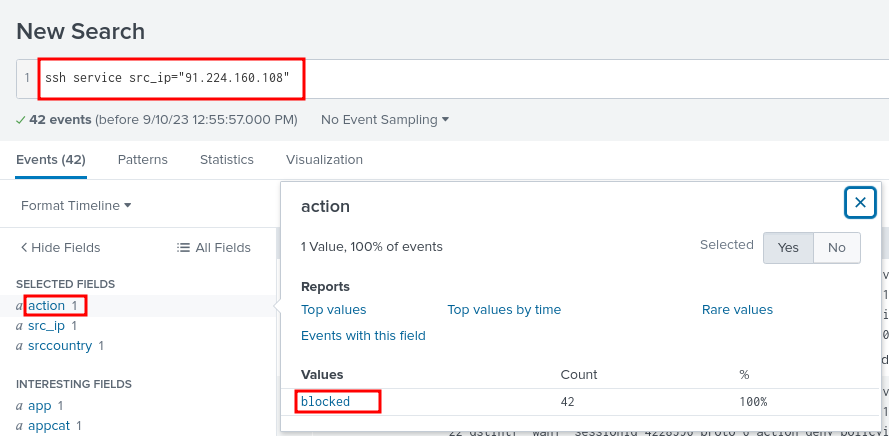

## 55H Access Challenge Writeup
---
 

 

In this challenge, we're provided with an IP address, that when launched, opens up the **splunk web interface**

 

 

The challenge description indicates that there was huge traffic directed to the SSH server. This led me to querying splunk with, **SSH service**

 

From this, I could see **152 SSH service messages that were logged**

From here, I started filtering, based on the required options, so as to get the flag.

 

**X: How many source IPs attempting to connect  → Number**

From **src_ip** the field value is **19**

 

**Y: The Source IP with the most connections → x.x.x.x**

From **src_ip** the field value is **91.224.160.108**

 

**Z: The Source IP with the most connections country → xxxxxxx**

We identified the source IP with the most connections as **91.224.160.108**. Now to find the associated country.

From **src_ip="91.224.160.108"** the field value is **Netherlands**

 

**W: The Firewall action taken from the security control → xxxxxxx**

Based on the **"action"** value, the firewall action taken was **blocked**

 

The **flag**, in this format, **flag{X:Y:Z:W}**, is, **flag{19:91.224.169.108:Netherlands:blocked}**

However, this gave me an error. On further research, I was able to identify the **geolocation** of the IP address **19.91.224.169.108** as **Finland**.

Therefore the correct flag format, ought to be, **flag{19:91.224.169.108:Finland:blocked}**

