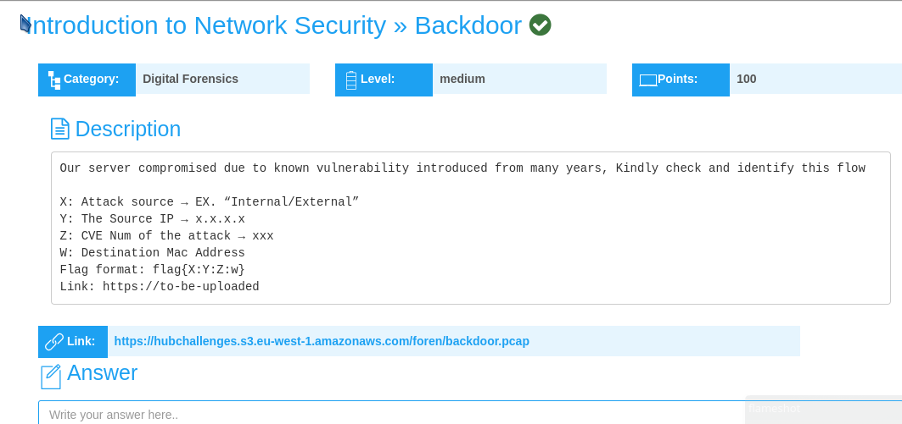
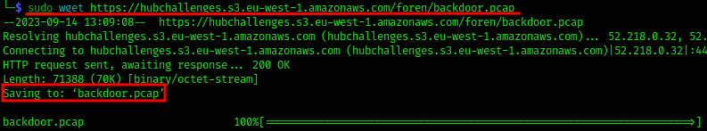
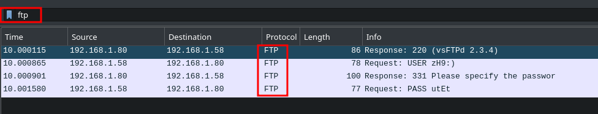
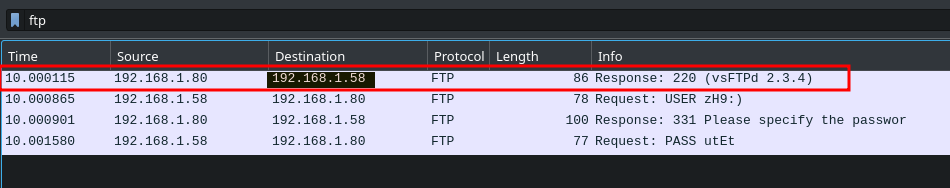
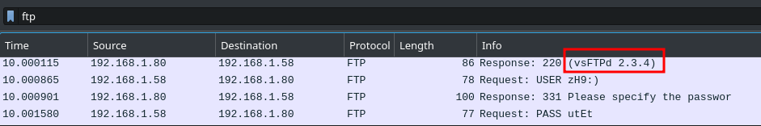
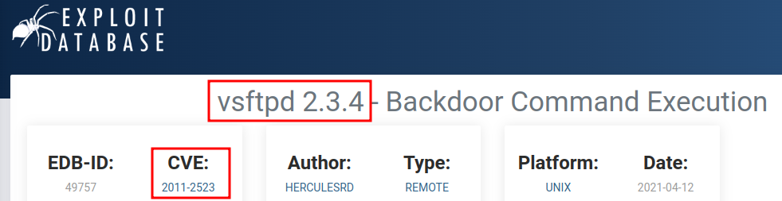
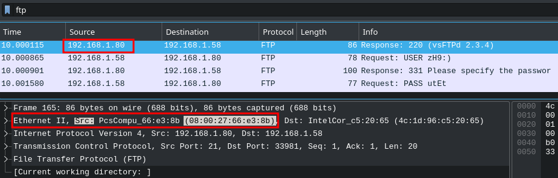

## Backdoor Challenge Writeup
---
 

 

In this challenge, we're provided with a **pcap file**, that contains, **network traffic of a server**, compromised by a **known vulnerability**, introduced from many years.

First step is to **download the pcap file to my local network**, so I can analyze it.

 

Then use **wireshrak** to analyze the pcap file.

On analyzing the **protocols** on the pcap file, found the **FTP protocol to be vulnerable**.

Hence, **filtered** my search to only **FTP**.

 

**X: Attack source → EX. “Internal/External”**

From the **first ftp packet**, as per the **response**, the **attack source IP**, appears to be an **INTERNAL IP address,  192.168.1.58.**

 

**Y: The Source IP → x.x.x.x**

The **source IP address(attacker IP)**, is **192.168.1.58.**

 

**Z: CVE Num of the attack → xxx**

To find the **CVE Num**, I analyzed a packet and found the **ftp version as vsftpd(2.3.4)**. I googled this and found its cve num to be, **CVE-2011-2523**

 

 

**W: Destination Mac Address**

To find the **destination mac address(server address)**, having already identified the **source IP as 192.168.1.58**, and **destination IP as 192.168.1.80**, I looked for the corresponding **MAC address of 192.168.1.80**.

Found the **destination mac address** as, **08:00:27:66:e3:8b**

 

The final flag:

**flag{Internal:192.168.1.58:CVE-2011-2523:08:00:27:66:e3:8b}**

