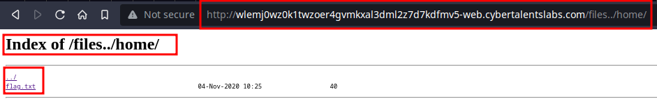

## Bean Challenge Writeup
---
<br>


In this challenge, we're providded with a link to a website.

```shell
http://wlemj0wz0k1twzoer4gvmkxal3dml2z7d7kdfmv5-web.cybertalentslabs.com/
```

The **website** is an image of the famous actor, **mr.bean**, quite literally.

<br>

On inspecting the sites **source code**, found **nothing** worthwhile.

Went on to perform some **directory enumeration** using **gobuster**; see if there were any **hidden folders and directories/sub-directories.**

```shell
gobuster dir -u http://wlemj0wz0k1twzoer4gvmkxal3dml2z7d7kdfmv5-web.cybertalentslabs.com/ -w /usr/share/dirb/wordlists/common.txt
```

Found a file, **index.html** and folder, **/files/**


<br>

The **/files folder** contained a **number of direcroties.** Particularly took note of the **nginx folder,** since the website was **hosted** on a **nginx server.**


<br>

Inside the **nginx folder**, is the **default.conf** file, that contains **basic information** on the **server** such as **ports, paths** and **names.**


<br>

Downloaded the **default.conf** file and read its contents using;

```shell
wget http://wlemj0wz0k1twzoer4gvmkxal3dml2z7d7kdfmv5-web.cybertalentslabs.com/files/nginx/conf.d/default.conf
```

```shell
nano default.conf
```


<br>

Found that they are using **alias** command to **rename** the **/etc/** directory, into **/files/**

This tells us that, we are currently in the **etc directory.**  We should **move to another directory**, possibly **go back**, to the **root directory.**

To do this, we **insert ".."" after /files,** such that the link will be;

```shell
http://wlemj0wz0k1twzoer4gvmkxal3dml2z7d7kdfmv5-web.cybertalentslabs.com/files../
```

<br>

This indeed, does lead us to the **root directory** of the **server.**


<br>

From here, after exploring each directroy, I found the **flag** in the **home directory.**



<br><br>


```shell
FLAG{Nginx_nOt_aLWays_sEcUre_bY_The_waY}
```


