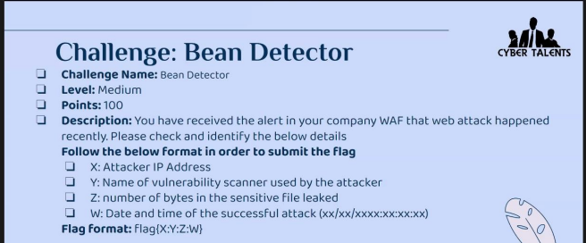

## Bean Detector Challenge Writeup
---
<br>



challenge link

```shell
https://hubchallenges.s3.eu-west-1.amazonaws.com/foren/beansdetectorlogs
```

<br><br>

In this challenge, we are provided with a **log file to analyze**.

First, I download it using **wget.**

```shell
wget https://hubchallenges.s3.eu-west-1.amazonaws.com/foren/beansdetectorlogs
```

Then use **nano** to read the contents of the **beansdetectorlogs**

```shell
nano beansdetectorlogs
```
<br>

After opening the log file, I notice that a **specific IP address** is **fuzzing** the **website** using the tool **Wfuzz.**


<br>

The challenge hints that the **attack was successful.** 

This means that there was a **successful HTTP request**. 

The **standard HTTP status code** to indicate this is **200 OK**

I searched for a **log** that had a **code 200** to get the **critical file.**


<br>

**X:Attacker IP address**

**172.17.0.1**

<br>

**Y:Name of the vulnerability scanner used by the attacker.**

**Wfuzz**

<br>

**Z:Number of bytes in the sensitive file leaked**

**49**

<br>

**W:Date and time of the successful attack(xx/xx/xxxx:xx:xx:xx)**

**12/Jun/2022:11:05:12**

<br>


<br>

The final flag;

```shell
flag{172.17.0.1:wfuzz:49:12/06/2022:11:05:12}
```
