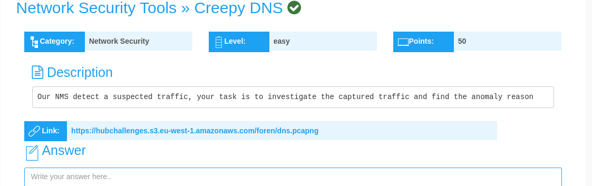
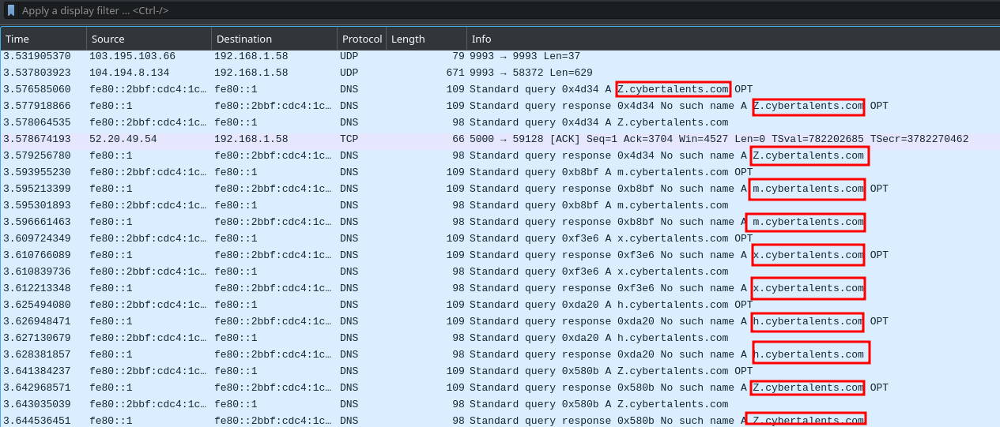
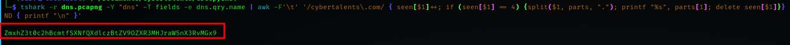
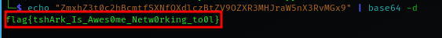

## Creepy DNS Challenge Writeup
---
<br>



<br>

In this challenge, we are told that a **network management system(NMS),** detected **suspicious network traffic**, and are tasked with **finding the anomaly reason.**

A **.pcap file** is also provided.

<br>


I use **wget to download** the file.

```shell
wget https://hubchallenges.s3.eu-west-1.amazonaws.com/foren/dns.pcapng
```
<br>

Used **wireshark** to analyze the **.pcap file**

Found a number of cybertalents subdomains that begin with a strange letter.



<br>

Gathered the **first letters** of the **subdomains** using **tshark** using the command;

```shell
tshark -r dns.pcapng -Y "dns" -T fields -e dns.qry.name | awk -F'\t' '/cybertalents\.com/ { seen[$1]++; if (seen[$1] == 4) {split($1, parts, "."); printf "%s", parts[1]; delete seen[$1]}} END { printf "\n" }'
```
<br>



<br>

This resulted in a **base64 output code**, that I **decoded** and got the **flag.**

```shell
echo "ZmxhZ3t0c2hBcmtfSXNfQXdlczBtZV9OZXR3MHJraW5nX3RvMGx9" | base64 -d 
```
<br>



The final flag;

```shell
flag{tshArk_Is_Awes0me_Netw0rking_to0l}
```
---
---
<br>

A **brief explanation of the tshark command;**

- **tshark** is a command-line packet analyzer utility.
- **-r dns.pcapng** Specifies the input file "dns.pcapng" from which packet data will be read.
- **-Y "dns"** Applies a display filter to only show DNS packets in the capture file.
- **-T fields** Specifies the output format as tab-separated fields
- **-e dns.qry.name** Specifies that you want to extract the DNS query name field from each DNS packet.
- **|** Symbol used to pass the output of the preceding command as input to the next command.
- **awk** Is a text-processing tool that allows you to specify patterns and actions for processing text data
- **-F'\t'** Sets the field separator to a tab character, as the output from tshark is tab-separated.
- **/cybertalents\.com/** This is a regular expression pattern that matches lines containing "cybertalents.com."
- **{ seen[$1]++; if (seen[$1] == 4) {split($1, parts, "."); printf "%s", parts[1]; delete seen[$1]}}:**

    For lines that match the pattern, it increments a counter (seen[$1]) for each unique DNS query name ($1).
    
    When a query name appears for the fourth time (meaning it's the fourth occurrence of that domain), it splits the query name into parts using a dot as the separator and prints the first part (parts[1]), which is the letters before ".cybertalents.com."

- **delete seen[$1]** The delete seen[$1] statement removes the entry for the DNS query name to reset the count for that domain.
- **END { printf "\n" }** After processing all lines, it prints a newline character to separate the output.


