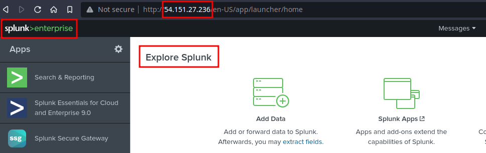

## Four0Four Challenge Writeup
---
 

In this challenge, we're instructed to find the **source IP** and the **attacker source country**, of a **web bruteforce attack** observed on the **IIS server.**

 

We're provided with an **IP address, 54.151.27.236**, that leads to a **web based splunk interface**.

 

I first start by **querying splunk** for the **IIS data** using **sourcetype=iis**. This gives me **22,615 events.**

 

I begin filtering the data, based on the instructions provided.

 

**X: The highest number of non existent URLs request sent by the attacker → Number**

To find this, I use the **sc_status="404"** query, and it narrows down my events to **2119 events.**

I noted that this was **not** the **correct** number of non existent URLs requests sent, hence, I continued filtering, based on the other requirements.

 

**Y: The Source IP → x.x.x.x**

To find the **source IP**, I used the **client IP** filter, **c_ip**, to find the **IP address** of the client or user that interacted with the server.

This gave me **two IP addresses**, a **public** and **private** one. I used the **public IP**, **40.80.148.42**

 

**Z: The attacker source country → xxx**

To find the attacker source country, 
