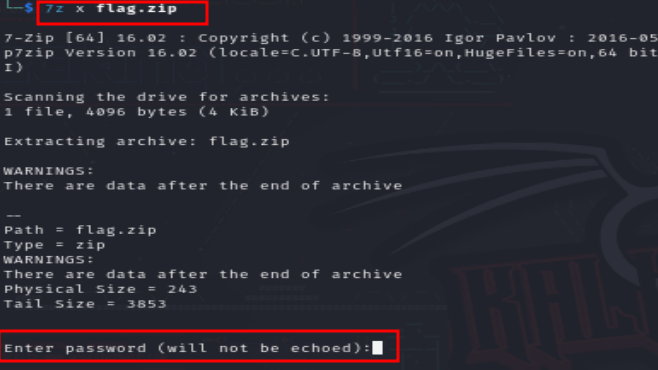

## MEGO Challenge Writeup
---
---
<br>


In this challenge, we are provided with a **snapshot of virtual memory(RAM)** as a **memory dump file(memdump)**

<br>

First started by **downloading the memdump file using wget.**

```shell
wget https://hubchallenges.s3.eu-west-1.amazonaws.com/Forensics/memdump123456789.mem.tar.gz
```

Then **extracted** it using;

```shell
sudo tar -xzvf memdump123456789.mem.tar.gz
```


<br>

Then used **Volatility3** to examine the **volatile memory(RAM)**; see if I could **extract** any **valuable information.**

Started by **determining the image info**

```shell
python3 vol.py -f /path-to-memdump-file windows.info
```
```shell
python3 vol.py -f memdump.mem windows.info
```


From the **output**, the image belongs to **NTBuildLab 7601.17514.ad64.fre.win7sp1_rtm.**

This tells us the **profile** to use; **win7sp1.**

<br>

Then to **scan** the memdump.mem file, for **file objects;** see if I could **find information** about **files currently running in memory.**

To **better filter my search**, I added the **grep command**, to search for **input that contained the word "flag".**

```shell
python3 vol.py -f /path-to-memdump-file windows.filescan | grep 'flag'
```

```shell
python3 vol.py -f memdump.mem windows.filescan | grep 'flag'
```


<br>

The **result** was **4 files** that contained a **'flag'.**

Decided to analyze the first file at, **C:\Users\admin\Downloads\flag.txt.zip.**


<br>

To **extract** the file, I used;

```shell
python3 vol.py -f path-to-memdump-file windows.dumpfiles --physaddr 0x5fd82710
```

```shell
python3 vol.py -f memdump.mem windows.dumpfiles --physaddr 0x50dc4370
```


The file was outputted to a **.dat file**

Running the **file** command on the **.dat file**, showed that it was recognized as a **zip archive.**

Therefore **renamed** it to a **.zip file, flag.zip** 


<br>

Tried to **extract the file**, but it had a **password.**



<br>

Decided to use **zip2john,** to **extract the password hash** to use, from the **ZIP file, flag.zip**

```shell
zip2john zip_file_name > zip_file_name.txt
```

```shell
zip2john flag.zip > flag.txt
```


Then used **john the ripper to crack the hash**, but the **default wordlist did not crack the password.**

<br>

After spending quite some time stuck on the challenge, I decided to **check the browser history.**

**Volatility3** however, did not support the **iehistory plugin**; only works in **volatility 2.**

Therefore, I tried **browsing the history** with **volatility 2** using; 

```shell
python2 vol.py -f memdump.mem --profile=Win7SP1x64 iehistory
```


