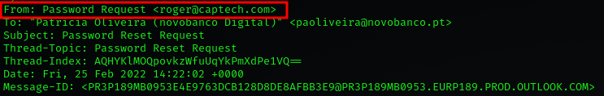

## Pass reset Challenge Writeup
---
---
<br>


<br>

In this challenge, we're provided with a link to a **zip file, passreset.msg.zip.**

```shell
https://hubchallenges.s3.eu-west-1.amazonaws.com/foren/passreset.msg.zip
```
<br>

**Downloaded** it using **wget** and tried to **unzip it.**

```shell
sudo wget https://hubchallenges.s3.eu-west-1.amazonaws.com/foren/passreset.msg.zip
```


It, however, required a **password.**

<br>

I used **john the ripper to crack the password.**

I first had to obtain the **hash value of the file.**

To do so, I converted the **passreset.msg.zip file, to a text file**, using the command;

```shell
zip2john passreset.msg.zip > passreset.txt
```


<br>

I then used **john the ripper** to **crack** the file for its **password,** using the command;

```shell
john passreset.txt
```

This command uses **john the ripper's default wordlist** to **crack the password.**

<br>

The result **password** was, **infected.**


<br>

**Unzipping** the file with the **'infected' password**, resulted in a file, **Password Reset Request.msg**


<br>

Now to find the required **flag elements.**

<br>

**X: The sender mail ID**

I ran **strings** on the **Password Reset Request.msg** file, and found the **sender's mail ID** as **roger@captech.com**

```shell
strings 'Password Reset Request.msg' 
```


<br>

**Y: The date the user received the email(DD/MM/YYYY)**


**25/02/2022**

<br>

**Z: The domain name of the associated URL on mail body (ABC.com)**

To find the **domain name** of the associated URL on mail body I **decoded some base64 encoded output**, that I got when I ran **strings** on the **'Password Reset Request.msg' file.**

```shell
strings 'Password Reset Request.msg' 
```


<br>


Found the domain to be, **attemplate.com**


<br>

**W: Do you think this email is more likely to be legitimate or suspicious, add L for Legitimate or S for Suspicious.**

Searching the **reset password attemplate.com URL** on **virustotal**, showed that it was a **suspicious phishing email.**


<br>

The **final flag;**

```shell
flag{roger@captech.com:25/02/2022:attemplate.com:S}
```


