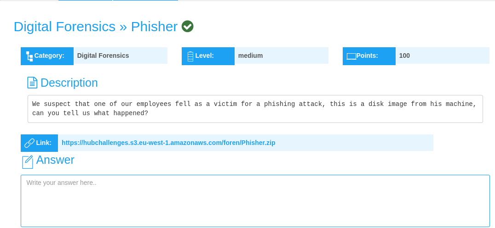
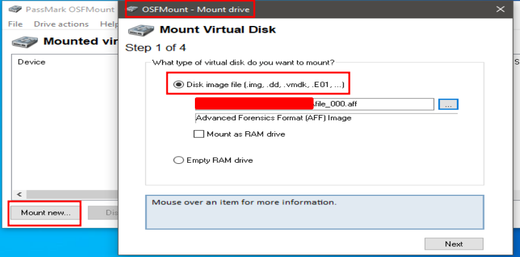
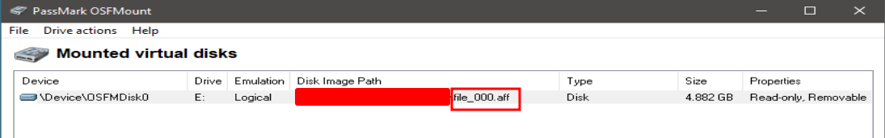
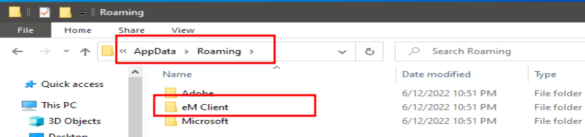
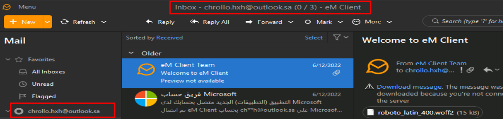
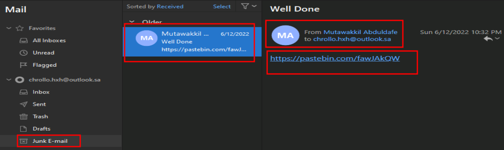
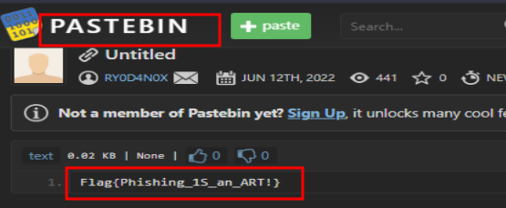

## PHISHER Challenge Writeup
---
<br>



<br>

In this challenge, we're provided with a zip file, **Phisher.zip.**

Used **wget** to **download** the file to my machine.

```shell
sudo wget https://hubchallenges.s3.eu-west-1.amazonaws.com/foren/Phisher.zip
```

**Unzippizing** the file, yielded a **file_000.aff** file.

The challenge description hints that it's a **disk image.**

I use **osfmount** to **mount** the disk file.



<br>



<br>

On analyzing the disk file, I found a user named **chrollo.**

Analyzing chrollo's **AppData/Roaming** folder, I found **eMClient**, which is an **email client software,** designed to help users manage their email accounts.



I installed **eMClient on my machine**, and **replaced** the **default eMClient folder**, created when the app is installed on a device, with the **eMClient folder from the disk image(chrollo's eMClient folder)**



On exploring chrollo's email, particularly the **junk e-mail**, I found a **pastebin link** that contained the **flag.**



<br>



The final flag;

```shell
Flag{Phishing_1S_an_ART!}
```


