## Remote Hacker Challenge Writeup
---
---

<br>

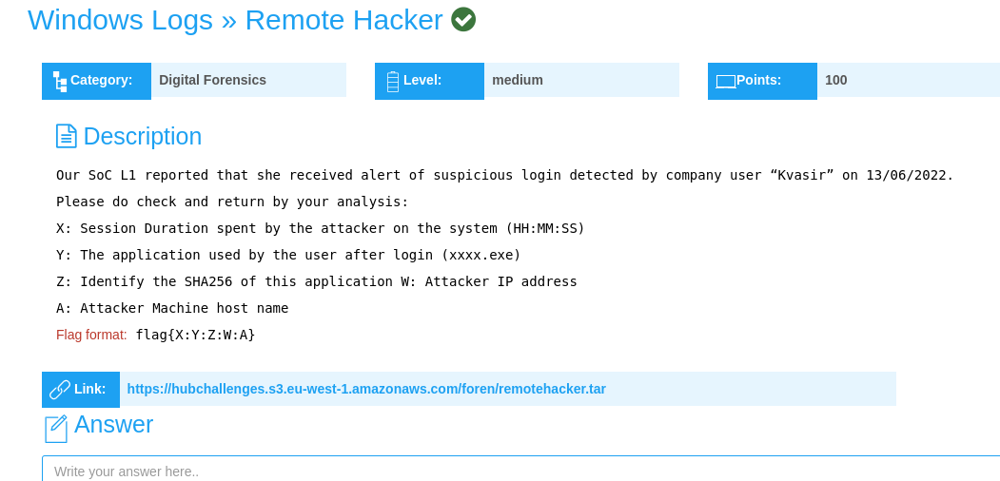

<br>

In this challenge, we are told that there was **an alert of a suspicious login detected,** and we are provided with a **.tar file,** that we have to **extract to get its contents.**

To **download** and **extract** the **files contents;**

```shell
sudo wget https://hubchallenges.s3.eu-west-1.amazonaws.com/foren/remotehacker.tar
```

```shell
sudo tar -xvf remotehacker.tar
```

<br>

Extracting the contents of the **remotehacker.tar** file, results in, **Security.evtx** and **Microsoft-Windows-Sysmon_4Operational.evtx.**

An **.evtx file** is a file format used by the **Microsoft Windows operating system** to **store event log data.**

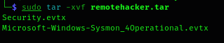

<br>

I switched to a **Windows operating system**, to **better open the .evtx files.**

On **windows**, I used the **event viewer utility**, to open the **.evtx files.**

To access the event viewer, press **Win + X,** and select **event viewer.**

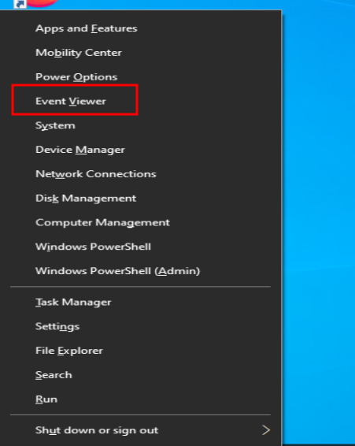

Then opened the **Security.evtx saved log** first, under **security log type.**

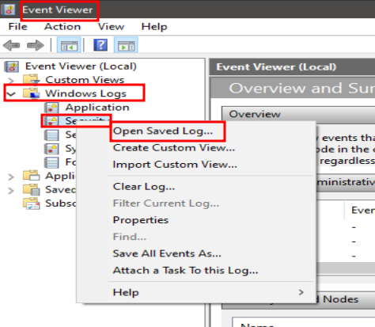&nbsp;&nbsp;&nbsp;&nbsp;&nbsp;&nbsp;&nbsp;&nbsp;&nbsp;&nbsp;&nbsp;&nbsp;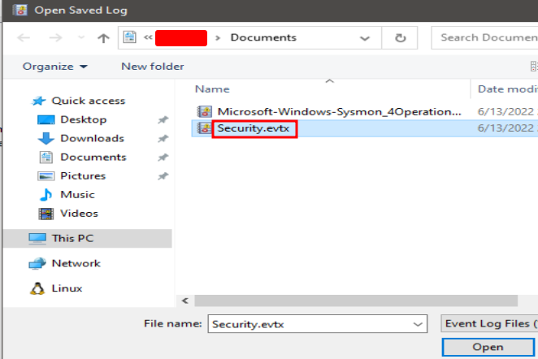

<br>

I first started by **filtering my search for login events,** that occurred on the **13/06/2022**, as indicated on the challenge info section.

The **windows login event ID is 4624.**

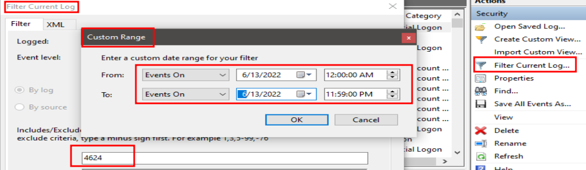

<br>

The challenges' name is **remotehacker.**

This means that I should look for a **remote network logon**, which is categorized as a **Logon Type 3.**

The **first event** I found to match the **Logon Type 3** was at **6/13/2002 8:02:15 AM.**

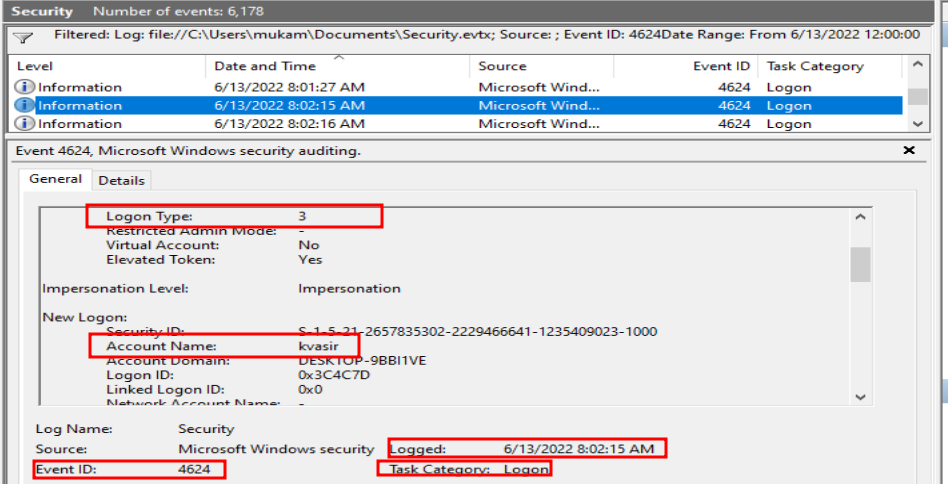

<br>

Now to answer the challenge's questions and find the flag.

<br>

**X: Session Duration spent by the attacker on the system(HH:MM:SS)**

<br>

To find the **session duration**, I would have to find the time the attacker **logged in** and **logged off** of the system.

Then find the **difference between the two**, to find the **session duration.**

I already have the time the attacker logged in, **6/13/2002 8:02:15 AM.**

To find the time he **logged out/off,** I filtered my search using the **log off event ID, which is 4634,** and **events logon ID, 0x3C4C7D.**

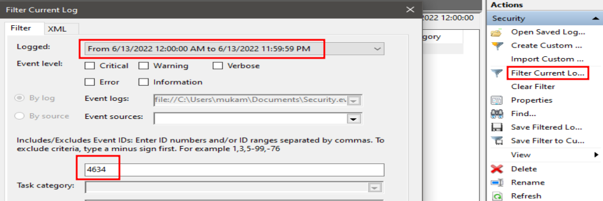

<br>

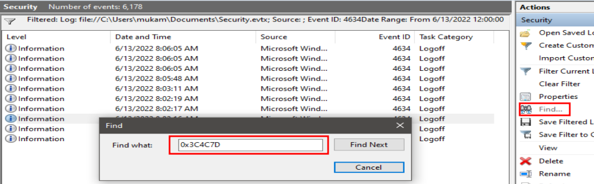

<br>

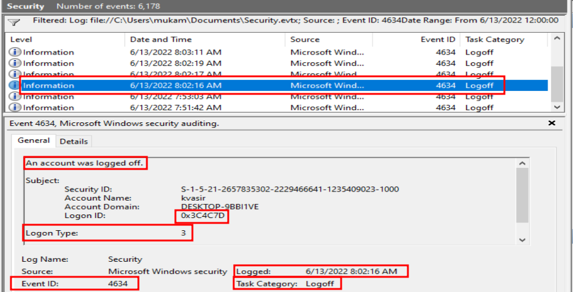

From the filtered log event, the **attacker logged out/off** at **6/13/2002 8:02:16 AM.**

The **difference** between the **login and logoff** is **0:00:1 seconds.**

This is **not enough time** for an **attacker to execute a malicious program or perform any malicious act.**

<br><br>

I therefore have to look for another **logon type 3 event.**

The next event was at **6/13/2002 8:03:08 AM,** with the **event logon ID, 0x3D6898**

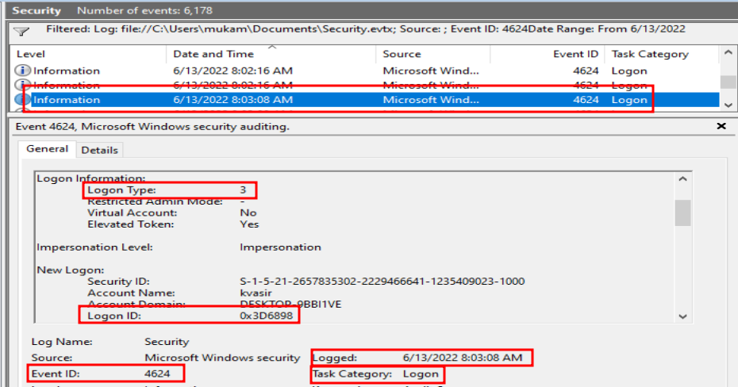

To find the time he **logged out/off,** I filtered my search using the **log off event ID, which is 4634,** and **events logon ID, 0x3D6898.**

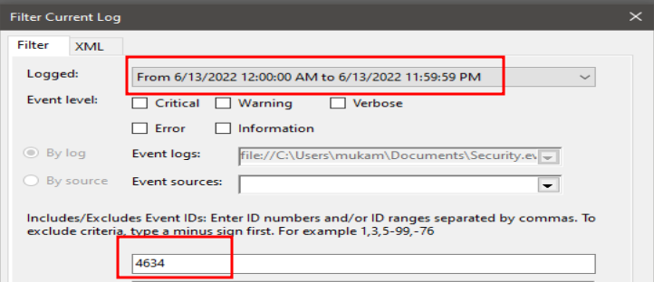

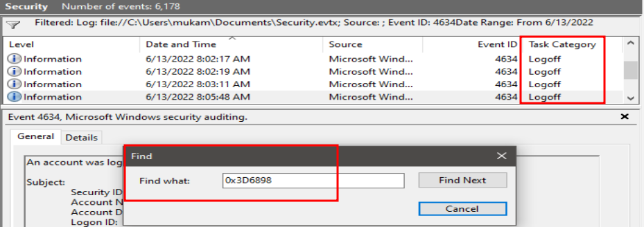

This event was logged off at, **6/13/2002 8:05:48 AM**

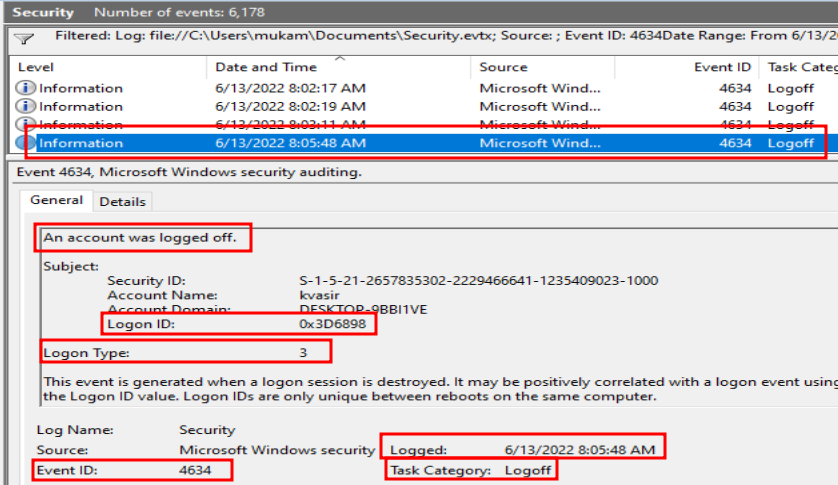

To find the **session duration**, I found the **difference** between the logon, **6/13/2002 8:03:08 AM**, and logoff, **6/13/2002 8:05:48 AM.**

<br>

**00:02:40**

<br>

**A: Attacker machine host name**

From the logon event at, **6/13/2002 8:03:08 AM**, the attacker machine host name; 

**Nitro**

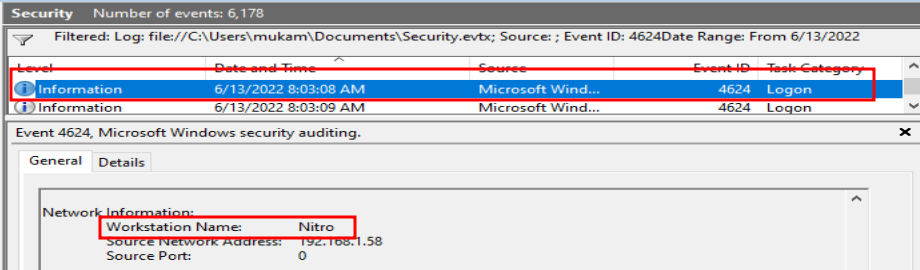

<br>

**W: The attacker IP address**

From the logon event at, **6/13/2002 8:03:08 AM**, the attacker IP address; 

**192.168.1.58**

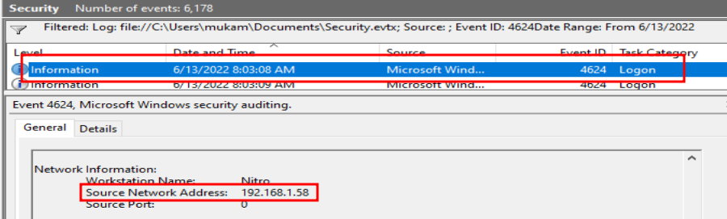

<br><br>

**Y: The application used by the user after login (xxxx.exe)**

<br>

To find the application used by the user after login, we have to search in, **Microsoft-Windows-Sysmon_4Operational.evtx.**

The user opening an application after login, is considered a **process creation event, as it typically involves the creation of a new process to run the application.**

**Sysmon(System Monitor), which monitors and logs system activity to the Windows event log, Event ID 1, is associated with process creation events.**

<br>

I therefore filtered my search to **Event ID 1,** and time after session login which was, **6/13/2002 8:03:08 AM,** and before session logoff,  **6/13/2002 8:05:48 AM.** 

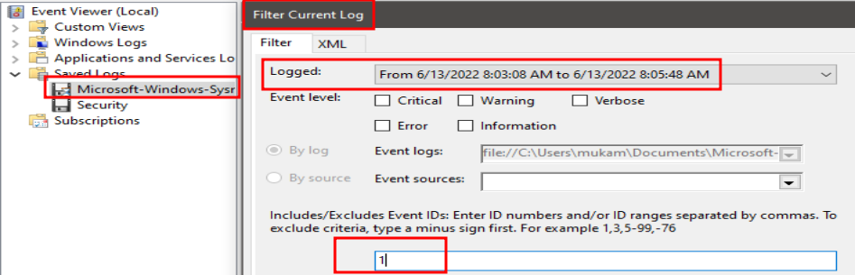

I found **3 process creation events** that happened during the **attackers' session time.**

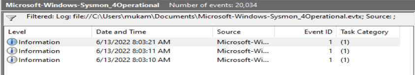

On analyzing the **first event,** I found out that it was ran by the user **Ksavir,** and the associated application that he used was, **WIN32CALC.exe**

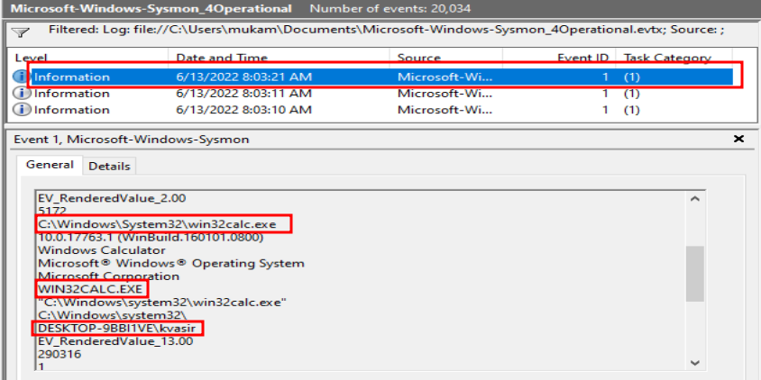

<br>

**WIN32CALC.exe**

<br>

**Z: Identify the SHA256 of this application**

The **SHA256 of the application** can be found in the **general info section of the event.**

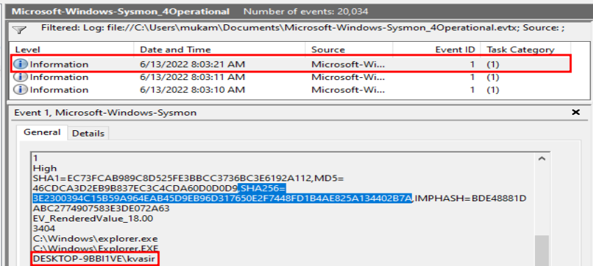

**SHA256=3E2300394C15B59A964EAB45D9EB96D317650E2F7448FD1B4AE825A134402B7A**

<br>

The final flag:

```shell
flag{00:02:40:win32calc.exe:3E2300394C15B59A964EAB45D9EB96D317650E2F7448FD1B4AE825A134402B7A:192.168
.1.58:Nitro}
```
