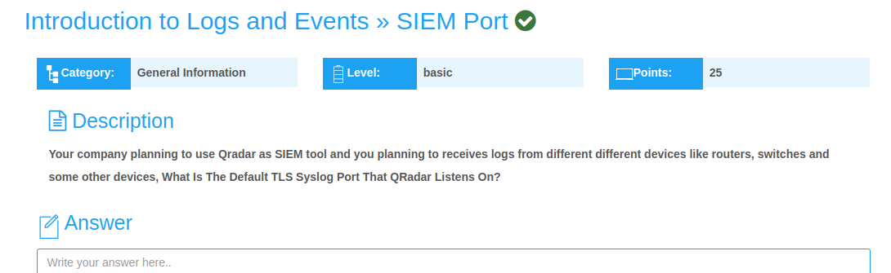
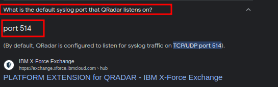

## SIEM Port Challenge Writeup
---
---

<br>



In this challenge, we are told that our company is planning on using **Qradar** as a **SIEM tool,** to **receive logs** from different devices such as **routers and switches,** and are asked to identify the **default TLS Syslog port that Qradar listens on.**

<br>

To find the flag, I simply googled, **What is the default TLS syslog port that QRadar listens on?** 

<br>



The final flag;

```shell
flag{514}
```
