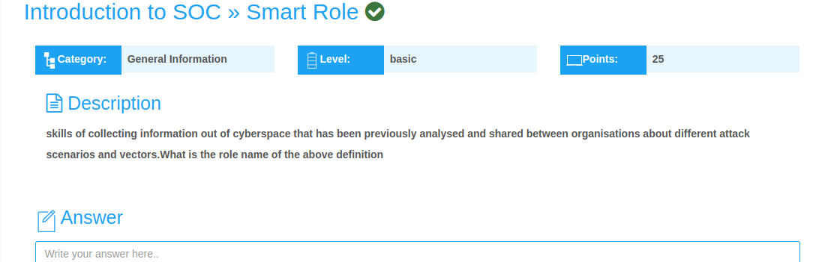
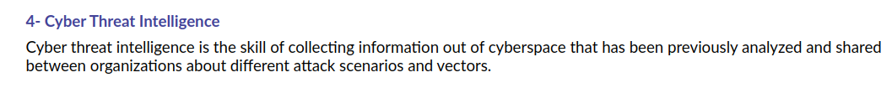

## Smart Role Challenge Writeup
---
---

<br>



From the **cybertalents website, lesson tab**, we find the description of **Cyber Threat Intelligence** as, the **skill of collecting information out of cyberspace that has been previously analyzed and shared between organizations about different attack scenarios and vectors.**



<br>

The final flag;

```shell
flag{Threat Intelligence}
```
