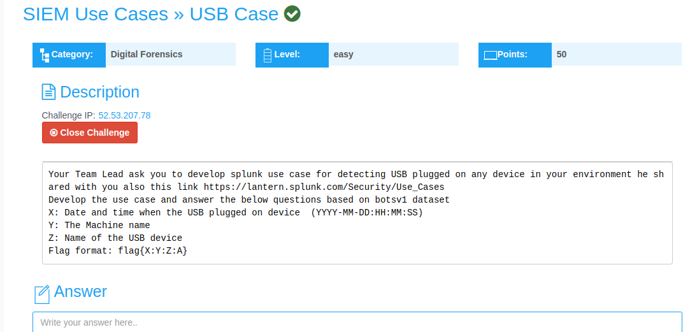
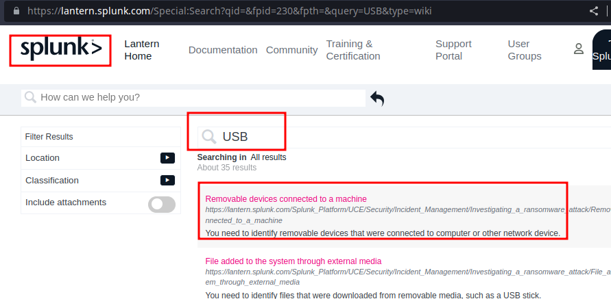
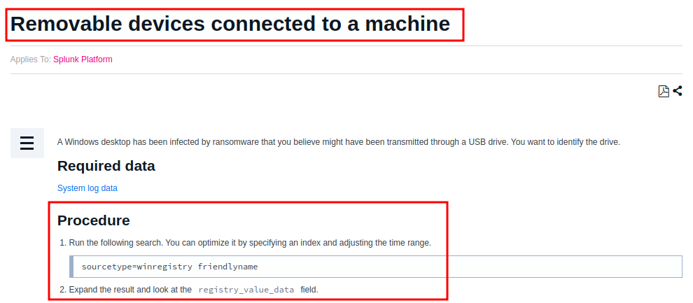
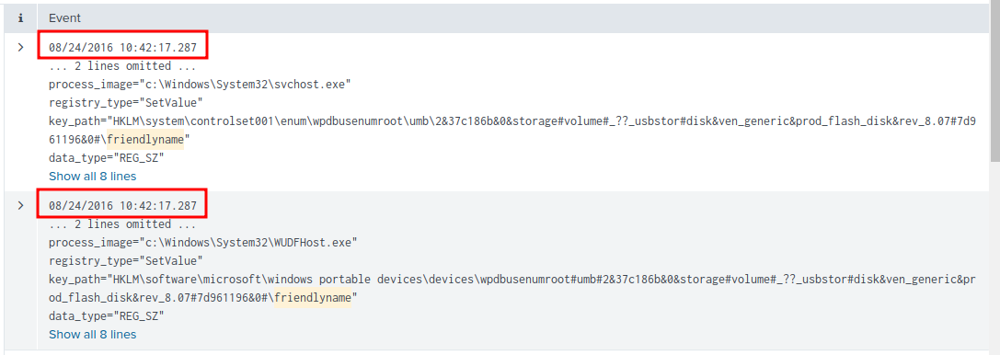
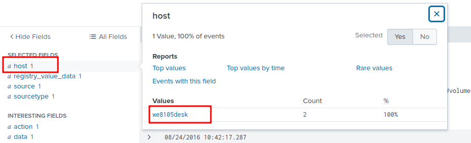
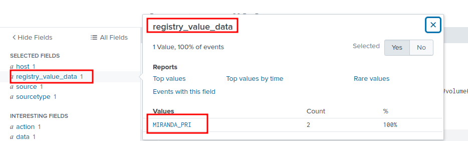

## USB Case Challenge Writeup
---
---

<br>



<br>

In this challenge, we are asked to **develop USB use case for detecting USB plugged on any device in your environment.**

An IP address to a **splunk web interface** is provided.

A link to **Splunk security use case explorer** is also provided in the challenge description.

I opened the link and **queried** the website for **USB.**

The challenge requires us to develop a use case for USB **plugged on any device**;  the related use case is **Removable devices connected to a machine**



<br>

The **Removable devices connected to a machine** use case, provides the required **search query to query splunk.**



```shell
sourcetype=winregistry friendlyname
```

Querying splunk yields **2 events.**


<br>

**X: Date and time when the USB plugged on device  (YYYY-MM-DD:HH:MM:SS)**



**2016-08-24:10:42:17**

<br>

**Y: The Machine name**



**we8105desk**

<br>

**Z: Name of the USB device**

The value in the **registry_value_data** field is the **name of the USB device.**



**MIRANDA_PRI**

<br>

The final flag;

```shell
flag{2016-08-24:10:42:17:we8105desk:MIRANDA_PRI}
```


